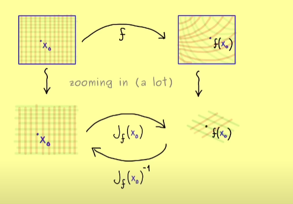

This post is meant as a simple and short calculus summary that can be refereced to as a preliminary knowledge for alot of the other posts.

#### Motivation: Best linear approximation

Our defintion will concern functions of the form

$$ f: \mathbb{R}^n \rightarrow \mathbb{R}^m $$

which can be thought of as a vector of scalar fields $f_i(\mathbf{x}) \colon \mathbb{R}^n \rightarrow \mathbb{R}$,

$$
f(\mathbf{x}) = \left( \begin{array}{c} f_1(\mathbf{x}) \\ f_2(\mathbf{x}) \\ \vdots \\ f_m(\mathbf{x}) \end{array} \right).
$$

**Definition: Total Derivative**

Let \\(f \colon U\subset \mathbb{R}^m \rightarrow \mathbb{R}^m\\). \\(f\\) is differentiable at \\(p \in U\\) if there exists an operator \\(A \in \mathcal{L}(\mathbb{R}^n,\mathbb{R}^n)\\) and a mapping \\(R\colon \mathbb{R}^n \rightarrow \mathbb{R}^m\\)
such that for all \\(u \in U\\)

$$
f(p+u) = f(p) + Au + R(u), \quad \textcolor{red}{(1)}
$$

where the remainder satifies

$$
\frac{\lVert R(u)\rVert}{\lVert u \rVert}\rightarrow 0, \text{ as } \lVert u \rVert \rightarrow 0. \quad \textcolor{red}{(2)}
$$

---

Note the norm we use here is arbitrary as the norms are equivalent on these spaces. This definiton with the help of the remainder function is often useful in proofs. We also state the equivalent and more familiar looking defintion:  \\(f\\) is differentiable at \\(p \in U\\) if there exists an operator \\(A \in \mathcal{L}(\mathbb{R}^n,\mathbb{R}^n)\\) such that

$$
\operatorname{lim}_{u\rightarrow 0} \frac{\lVert f(p+u)-f(u) - A[u] \rVert}{\lVert u \rVert} = 0
$$

The operator satifysing \\(\textcolor{red}{(1)},\textcolor{red}{(2)}\\) is unique, and is given by a familiar formula.

**Theorem 1**
If \\(f \colon U\subset \mathbb{R}^m \rightarrow \mathbb{R}^m\\) is differentiable at \\(p\\), then \\(Df(p)\\) is the unique linear operator satisfying  \\(\textcolor{red}{(1)} \text{ and }\textcolor{red}{(2)}\\). Moreover, the operator is given by the limit formula

$$
Df(p)[u] = \lim_{t \to 0} \frac{f(p+tu) - f(p)}{t}
$$

**Proof**

Let \\(T\\) be a linear operator satisfying \\(\textcolor{red}{(1)} \text{ and }\textcolor{red}{(2)}\\). Fix an arbitrary \\(u \in \mathbb{R}^n\\), take \\(v = tu\\).

$$
\begin{aligned}
    \frac{f(p+tu) - f(p)}{t} &= \frac{T(tu) +R(tu)}{t} \\
    &= T(u) + \frac{R(tu)}{t\lVert u\rVert}\lVert u \rVert\\
    \lim_{t \to 0} \frac{f(p+tu) - f(p)}{t} &= T(u) =Df(p)[u].
\end{aligned}
$$

Limits, when they exist, are unique. Hence, if \\(\hat{T}\\) is another linear transformation satisfying  \\(\textcolor{red}{(1)} \text{ and }\textcolor{red}{(2)}\\), then \\(T(u)=\hat{T}(u)\\) for all \\(u\\), and \\(T=\hat{T}\\).

\\(\blacksquare\\)

The linear operator \\(Df\\) is the total derivative (or in the infinite dimensional context the Frechet derivativec). On another note, recall the \\(ij^{th}\\) partial derivative

$$
\frac{\partial f_i}{\partial x_j} (p) = \lim_{t \to 0} \frac{f_i(p + t e_j) - f_i(p)}{t}
$$

This can easily be related to the total derivative.

**Corollary**

If the total derivative exists then the partial derivatives exist and the partial derivatives are the entries of the matrix representing the total derivative operator.

**Proof**

By theorem 1 this
$$
Df(p)[u] = \lim_{t \to 0} \frac{f(p+tu) - f(p)}{t},
$$

holds for any \\(u \in \mathbb{R}^n\\). Now set \\(u=e_j\\).

$$
Df(p)[e_j] = \lim_{t \to 0} \frac{f(p+te_j) - f(p)}{t} =  \lim_{t \to 0} \frac{1}{t}\left( \begin{array}{c} f_1(p+te_j)-f_1(p)  \\ f_2(p+te_j)f_2(p)   \\ \vdots \\ f_m(p+te_j)-f_m(p)   \end{array} \right)
$$

Note, while we now think of \\(Df(p)\\) as a matrix, \\(Df(p)[e_j]\\) picks out the \\(j^{th}\\) column of the matrix. Choosing the \\(i^{th}\\) row on each side

$$

\left( Df(p)[e_j] \right)_i = \lim_{t \to 0} \frac{f_i(p+te_j) - f_i(p)}{t} = \frac{\partial f_i}{\partial x_j} (p)

$$

Hence,

$$
Df(p)_{ij} = \frac{\partial f_i}{\partial x_j} (p).
$$

\\(\blacksquare\\)

## Diffeomorphisms

$$
C^k(\mathbb{R}^n, \mathbb{R}^m) = \left\{ f: \mathbb{R}^n \to \mathbb{R}^m \mid \text{for all } f_j: \text{ all partial derivatives up to order (in multiindices) } k \text{ exist and are continuous functions} \right\}
$$

Same for open sets \( U \subseteq \mathbb{R}^n \), \( V \subseteq \mathbb{R}^m \):  
$$
C^k(U, V)
$$

**Example**
Consider

$$
f: \mathbb{R}^2 \to \mathbb{R}^2, \quad f(x,y) = \begin{pmatrix} x \\ y^2 \end{pmatrix}
$$

$$
\mathcal{D}^\alpha f(x,y) = \begin{pmatrix} y \\ 0 \end{pmatrix} \quad \text{for } \alpha = (1,0)
$$
$$
\mathcal{D}^\alpha f(x,y) = \begin{pmatrix} 1 \\ 0 \end{pmatrix} \quad \text{for } \alpha = (1,1)
$$

Clearly, we always get contiouns functions in the components whatever multiindex we use.\\(\textcolor{red}{(check cont video)}\\)

$$
\Rightarrow f \in C^\infty(\mathbb{R}^2, \mathbb{R}^2)
$$

**Definition:**  
Let \\( U, V \subseteq \mathbb{R}^n \\) be open sets. A map \\( f: U \to V \\) is called a \\( C^k \\)-diffeomorphism if:
1. \\( f \in C^k(U, V) \\)
2. \\( f \\) is bijective
3. \\( f^{-1} \in C^k(V, U) \\)

**Example**

$$
f(x) = x^2, \quad f: (0, \infty) \to (0, \infty)
$$
$$
\Rightarrow f^{-1}(x) = \sqrt{x}, \quad f^{-1}: (0, \infty) \to (0, \infty)
$$
$$
\Rightarrow C^\infty \text{-diffeomorphism. Since the origin is excluded we get no trobule there.}
$$

**Counterexample**

$$
f(x) = x^3, \quad f: \mathbb{R} \to \mathbb{R}
$$
$$
\Rightarrow f^{-1}(x) = x^{1/3}, \quad f^{-1}: \mathbb{R} \to \mathbb{R}
$$

Here wer get an infinite slope at the origin. Not a \\(C^1 \\)diffeomorphism.

**Note**

\\(U,V \subseteq \mathbb{R}^n\\) and suppose \\(f \colon U \to V\\) is a \\(C^1 \\) diffeomorphism. Then we have

$$
f^{-1} \circ f = id_{U} \quad  f\circ f^{-1} = id_{V}
$$

For the identity map 

$$
id(x)=x = \left( \begin{array}{c} x_1 \\ x_2 \\ \vdots \\ x_n \end{array} \right)
$$

it is clear that the matrix representation of the total derivative, i.e. the Jacobian matrix is just the identity matrix. Computing the total at some \\(x\\)derivative on each side above, with the help of the chain rule, we get.

$$
D(f^{-1}\circ f)(x) = Df^{-1}(f(x))\circ Df(x) = J_{f^{-1}}(f(x))J_{f}(x) = I_{n\times n}
$$

and
$$
D(f\circ f^{-1})(x) = \dots =  J_{f}(x)J_{f^{-1}}(f(x)) = I_{n\times n}
$$

So \\(J_f(x)\\) is invertible for all \\(x\in U\\). Hence \\( \operatorname{det}J_f(x) \neq 0\\). Importantly, this does not work for dimensions 2 and above.

We introduce a weaker notion, local diffeomorpishmm. Examples of local diffeomorphisms will be coordinate transformations. That the diffeomorphism is local just means it does not hold globally, but rather if we restrict it to a smaller set.

**Example**

Polar coordinate transformation is given by

$$
\Phi\colon (0,\infty) \times \mathbb{R} \to \mathbb{R}^2 -\{0\}, \quad (r,\phi) \mapsto \left( \begin{array}{c} r \operatorname{cos}\phi \\ r\operatorname{sin}\phi \end{array} \right).
$$

$$
J_{\Phi} =
\begin{bmatrix}
\cos\phi & -r\sin\phi \\
\sin\phi & r\cos\phi
\end{bmatrix}
$$

Clearly

$$
\operatorname{det}(J_{\Phi}) = r>0.
$$

However, it is still not a diffeomorphism since \\(\Phi\\) is not injective. In the image below the blue line represents \\((0,\infty)\\) while the red represents the reals. Clearly the blue line in the \\( (0,\infty) \times \mathbb{R}\\) space is sent the blue line in cartesian space. While vertical lines in  (0,\infty) \times \mathbb{R} are sent to circles. A long vertical line will not give a injective map. Hence, if we keep the sets small enoough we have a local diffeomorphism.

Why does the inverse function theorem make sense? Suppose we have a function \\(f\colon U \to V\\). \\(f\\) is a nonlinear function, as seen in the image below how it distorts in a nonlinear way (not using scaling, rotation,shearing). When \\(f\\) is differentiable at \\(p\\), we know we can approximate the function near \\(p\\) as the sum of a constant term, a linear term and a sublinear term (see the defintion of the total derivative). Hence, near the point \\(p\\), "when we zoom in alot", we expect the transformation to behave almost linear in this region.  

 We have seen that when a function is differentiable near a point 

